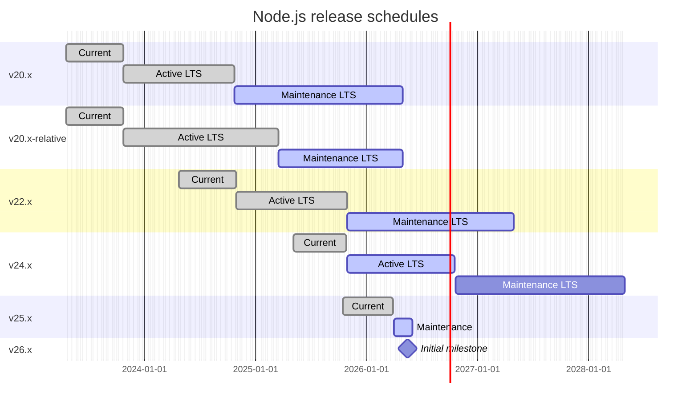

```mermaid
gantt
    dateFormat  YYYY-MM-DD
    title       Node.js release schedules
    excludes    weekends
    %% (`excludes` accepts specific dates in YYYY-MM-DD format, days of the week ("sunday") or "weekends", but not the word "weekdays".)

    section v20.x
    Current            :done,   des1, 2023-04-18,2023-10-23
    Active LTS         :done,   des2, 2023-10-24,2024-10-23
    Maintenance LTS    :active, des3, 2024-10-24,2026-04-30

    section v20.x-relative
    Current            :done,   cur, 2023-04-18, 2023-10-23
    Active LTS         :done,   act, after cur, 1y
    Maintenance LTS    :active, maint, after act, 2026-04-30

    section v22.x
    Current            :done,   des1, 2024-04-24,2024-10-28
    Active LTS         :done,   des2, 2024-10-29,2025-10-29
    Maintenance LTS    :active, des3, 2025-10-30,2027-04-30

    section v24.x
    Current            :done,   des1, 2025-05-06,2025-10-27
    Active LTS         :active, des2, 2025-10-28,2026-10-19
    Maintenance LTS    :        des3, 2026-10-20,2028-04-30

    section v25.x
    Current            :done,   des1, 2025-10-15,2026-03-30
    Maintenance        :active, des2, 2026-04-01,2026-06-01

    section v26.x
    Initial milestone : milestone, 2026-04-30
```
